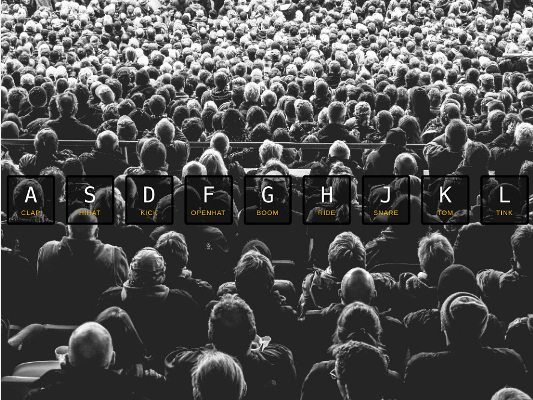

# Drum Kit

Hit the corresponding keys on your keyboard, and it will play the sound associated with that key.

## Live Demo

Click for a [Live Demo.](http://apps.javierlona.com/drum-kit/)

## Installing

Download the zip file and launch index.html in your web browser.

## License

This project is licensed under the MIT License - see the [LICENSE.md](LICENSE.md) file for details

## Acknowledgments

* [Wes Bos JavaScript30](https://javascript30.com/)
